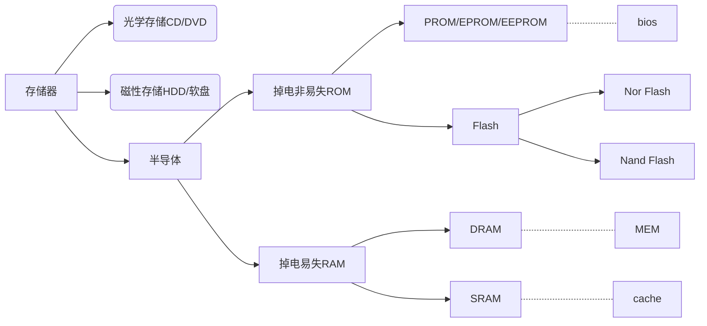
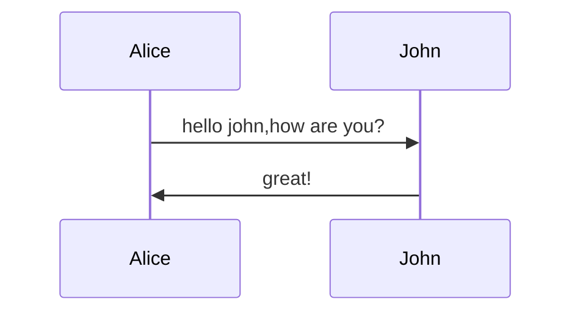
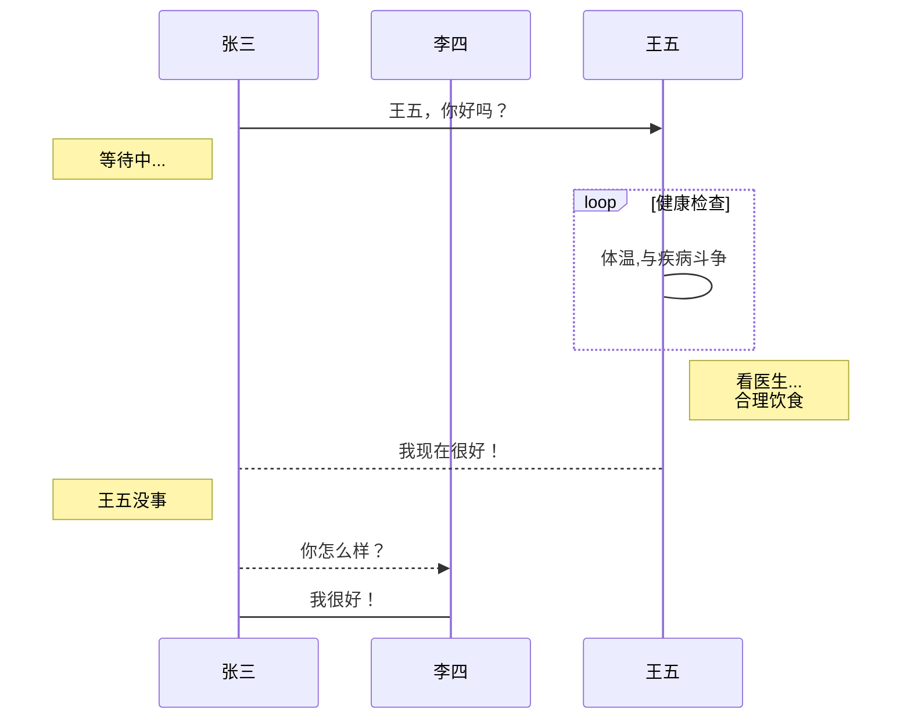
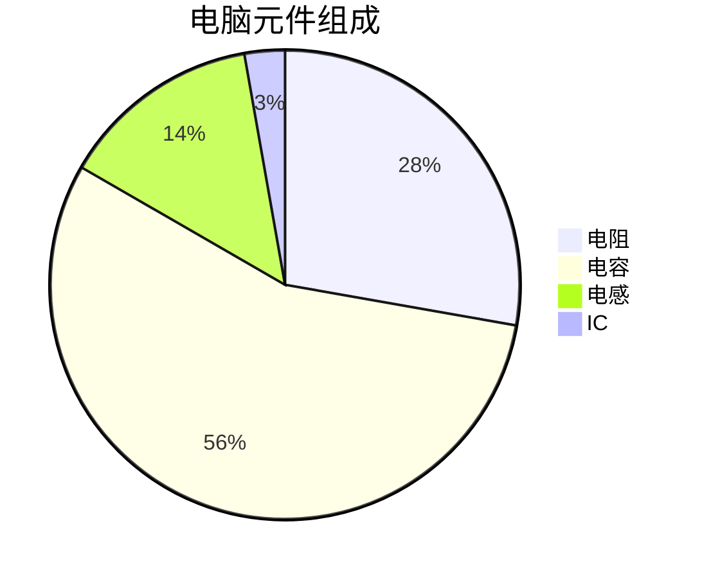
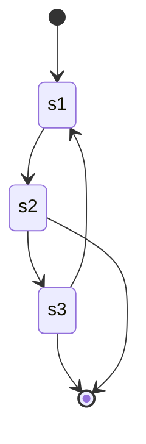
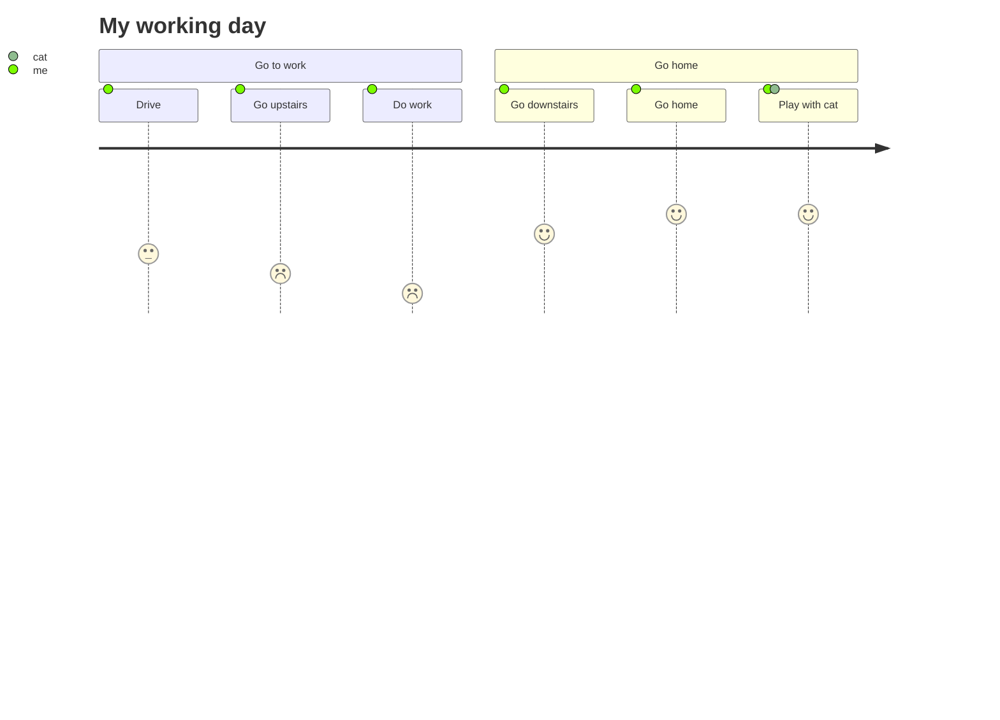
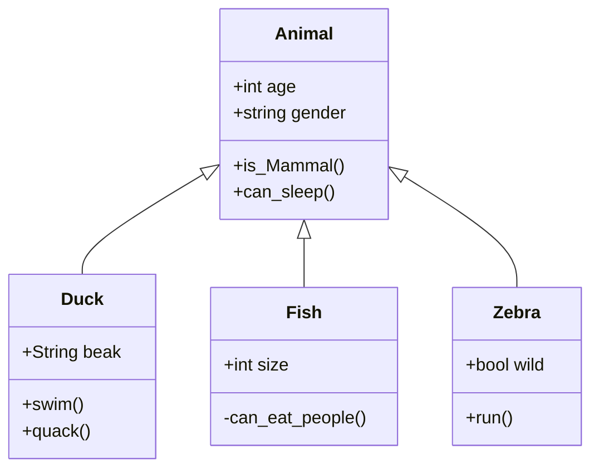
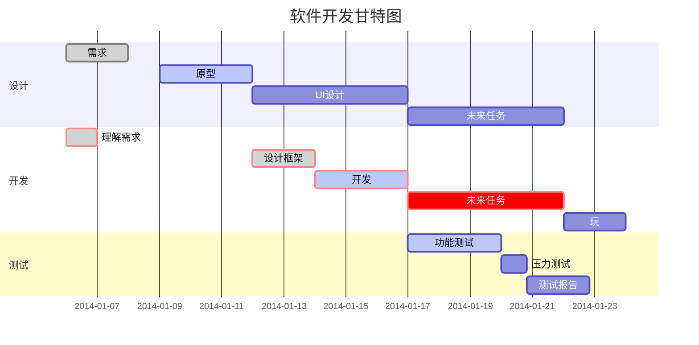
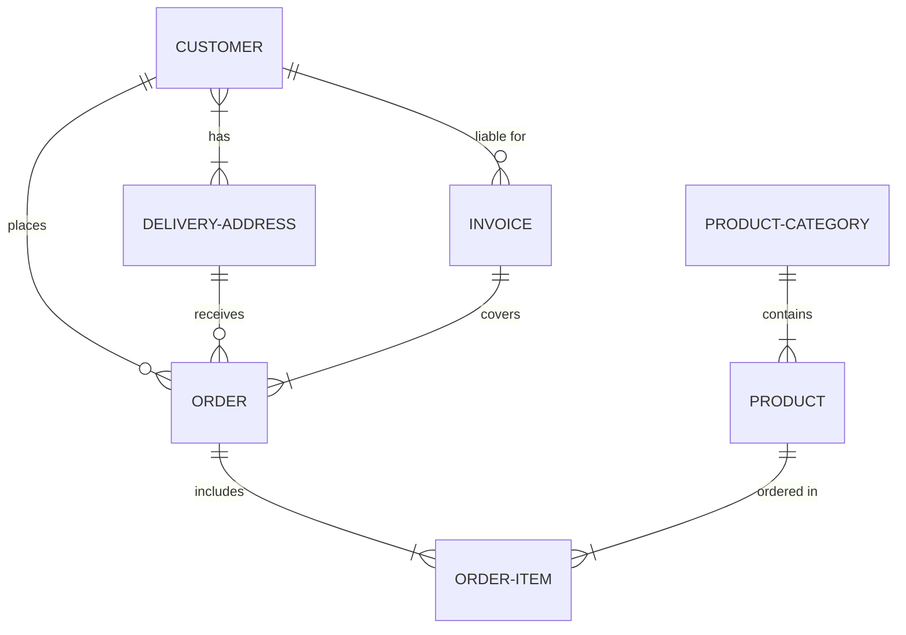

# 1 标题类

### 1.1 标题(# 后加空格)

# 标题1

## 标题2

### 标题3

#### 标题4

##### 标题5

###### 标题6

```markdown
# 标题1

## 标题2

### 标题3

#### 标题4

##### 标题5

###### 标题6
```

# 2 文本类

### 2.1 文本格式控制(不加空格)

*斜体*
**加粗**
***加粗斜体***
<u>下划线</u>
Fe+CuSO~4~=FeSO~4~+Cu
~~删除线~~
x^2^,^x^_^x^
==高亮==

```markdown
*斜体*
**加粗**
***加粗斜体***
<u>下划线</u>
Fe+CuSO~4~=FeSO~4~+Cu
~~删除线~~
x^2^,^x^_^x^
==高亮==
```

# 3 段落类

### 3.1 分割线

***

+++

---

```markdown
***

+++

---
```

### 3.2 引用(加空格)

>   这是引用

```markdown
> 这是引用
```

### 3.3 有序列表(. 后加空格)

把大象放进冰箱

1.  打开冰箱
2.  把大象塞进去
3.  关住冰箱
```markdown
1.  打开冰箱
2.  把大象塞进去
3.  关住冰箱
```

### 3.4 无序列表(加空格)

-   点赞
    -   一定
        -   一定
            -   一定
    
-   投币
    -   一定
        -   一定
            -   一定
-   转发
    -   一定
        -   一定
            -   一定
*   点赞

*   投币

*   转发

+   点赞

+   投币

+   转发

    ```markdown
    -   点赞
        -   一定
            -   一定
                -   一定
        
    -   投币
        -   一定
            -   一定
                -   一定
    -   转发
        -   一定
            -   一定
                -   一定
    *   点赞
    
    *   投币
    
    *   转发
    
    +   点赞
    +   投币
    +   转发
    ```

# 4 插入类

### 4.1 待办列表

-   [ ] 点赞
-   [ ] 投币
-   [ ] 转发

```markdown
-   [ ] 点赞
-   [ ] 投币
-   [ ] 转发
```

### 4.2 完成列表

-   [x] 点赞
-   [x] 投币
-   [x] 转发

```markdown
-   [x] 点赞
-   [x] 投币
-   [x] 转发
```

### 4.3 行内代码

`scanf();printf();`

```markdown
`scanf();printf();`
```


### 4.4 代码块

```c
int main()
{
    return 0;
}
```

```
​```c
int main()
{
    return 0;
}
​```
```

### 4.5 行内数学公式

$lim_{x \to \infty} \ e^{-x}=0$

```latex
$lim_{x \to \infty} \ e^{-x}=0$
```

### 4.6 数学公式块

$$
x_1=\frac{-b+\sqrt{b^2-4ac}}{2a}
$$

```latex
$$
x_1=\frac{-b+\sqrt{b^2-4ac}}{2a}
$$
```

### 4.7 表格

| 姓名 | 年龄 | 成绩 |
| ---- | ---- | ---- |
| 刘大 | 19   | 80   |
| 关二 | 20   | 85   |

```markdown
| 姓名 | 年龄 | 成绩 |
| ---- | ---- | ---- |
| 刘大 | 19   | 80   |
| 关二 | 20   | 85   |
```

### 4.8 脚注

一键三连[^三连]

[^三连]:点赞、投币、转发

```markdown
一键三连[^三连]

[^三连]:点赞、投币、转发

```

### 4.9 网页连接

[百度](https://baidu.com "一个搜索引擎")

```markdown
[百度](https://baidu.com "一个搜索引擎")
```

### 4.10 引用链接

[百度][百度id],[摆度][百度id]

[百度id]:https://baidu.com

```markdown
[百度][百度id],[摆度][百度id]

[百度id]:https://baidu.com
```

### 4.11 标题链接

请参考[行内数学公式](###4.5 行内数学公式)

请参考[数学公式块](###4.6 数学公式块)

```markdown
请参考[行内数学公式块](###4.5 行内数学公式)

请参考[数学公式块](###4.6 数学公式块)
```

### 4.12 URL

https://www.baidu.com

```markdown
https://www.baidu.com
协议+域名
```

### 4.13 网页图片链接


```markdown

```

### 4.14 本地图片链接


```markdown


```


### 4.15 Emoji表情

:smile:

:cry:

[表情全部名称](https://unicode.org/emoji/charts/full-emoji-list.html)

```markdown
:smile:

:cry:

[表情全部名称](https://unicode.org/emoji/charts/full-emoji-list.html)
```


### 4.16 html代码嵌入

#### 4.16.1 B站视频

<iframe src="//player.bilibili.com/player.html?aid=558127274&bvid=BV1de4y1r7t3&cid=836733069&page=1 &autoplay=0 &t=221 &muted=true" scrolling="no" border="0" frameborder="no" framespacing="0" allowfullscreen="true" style="zoom:450%;"> </iframe>


<iframe src="//player.bilibili.com/player.html?aid=558127274&bvid=BV1de4y1r7t3&cid=836733069&page=1&high_quality=1&danmaku=1&autoplay=0" allowfullscreen="allowfullscreen" width="100%" height="700" scrolling="no" frameborder="0" sandbox="allow-top-navigation allow-same-origin allow-forms allow-scripts"></iframe>

#### 4.16.2 点击显示内容

##### 问题1：冬瓜、黄瓜、西瓜、南瓜都能吃，什么瓜不能吃？

<details><summary>点击显示答案</summary><pre>傻瓜</pre></details>

##### 问题2：小华在家里，和谁长得最像？

<details><summary>点击显示答案</summary><pre>自己</pre></details>

##### 问题3：什么车子寸步难行?

<details><summary>点击显示答案</summary><pre>风车</pre></details>


# 5 绘图

## 5.1 typora流程图

```flow
srt=>start: 开始
on=>operation: 执行内容
cn=>condition: 是否是真？
e=>end: 结束
srt->on->cn(yes)->e
cn(no)->on
```

```flow
st=>start: 开始框
op=>operation: 处理框
cond=>condition: 判断框
sub1=>subroutine: 子流程
io=>inputoutput: 输入输出框
e=>end: 结束框
st->op->cond
cond(yes)->io->e
cond(no)->sub1(right)->op
```

```flow
st=>start: 开始
op=>operation: 两人见面
cond=>condition: 吃了吗？
e=>end: 结束
sub1=>subroutine: 一起去吃
st->op->cond(yes)->e
cond(no)->sub1->e
```

## 5.2 mermaid流程图

```mermaid
graph LR
id1[方形]-->id2(圆角)
id2==>id3{条件a}
id3.->|a=1| id4>结果1]
id3-->|a=2| id5((结果2))
	subgraph 子图
	id5==粗线==>id6{菱形}
	id6-.虚线.-id7>右向旗帜]
	id6--无箭头---id8((圆形))
	end
id9[横向流程图]
```



## 5.3 typora时序图

```sequence
title: typora时序图
note left of 刘大: 无聊
刘大->关二: 关二你好吗？（请求）
note right of 关二: 一刀一个人头
关二-->刘大: 我很好（响应）
关二->>张三: 张三你好吗？
note right of 张三: 两矛一个人头
张三-->>关二: 还行，不错！
note over 关二,张三: 我们都是好朋友！
participant 赵四
note right of 赵四: 没人和我一起玩
```

## 5.4 mermaid时序图





## 5.5 mermaid饼图



## 5.6 mermaid状态图



## 5.7 mermaid旅行图



## 5.8 mermaid类图



## 5.9 mermaid甘特图



## 5.10 mermaid实体关系图(ER图)



# 6 参考

[Markdown 语法参考](https://www.runoob.com/markdown/md-tutorial.html)

https://mp.weixin.qq.com/s/XohN4h6pyUzXo3mH2dUhYQ

https://jingyan.baidu.com/article/48b558e3035d9a7f38c09aeb.html

（公式）https://mp.weixin.qq.com/s/ENlgjseoWny6Znl2fKHQKA

http://latex.codecogs.com/eqneditor/editor.php


$$
\alpha_1^2+sin(\beta)=sec(\gamma)
$$


```python
sum=0
for i in range(10):		# 1~10之和
    sum=sum+i
    
print(sum)
    
```

$$
x1=\frac{-b+\sqrt{b^2-4ac}}{2\beta}-9
$$

```c
#include <stdio.h>
int main()
{
    int sum=0;
    for(i=0;i<10;i++)		//1~10之和
    {
        sum+=i;
    }
    printf("%d",sum);
    return 0;
}
```

$$
x_2=\pi
$$

```matlab
sum=0;
for i=1:10		% 1~10之和
	sum=sum+(i-1);
end
sum
```

| 风雨 | 彩虹 | 之后 |
| ---- | ---- | ---- |
| 6    | 5    | 5    |
| 8    | 5    | 5    |
| 5    | 5    | 5    |

$lim_{x \to \infty} \ e^{-x}=0$

$$\sum_{i=1}^n a_i$$

$$ h(\theta) = \sum_{j=0} ^n \theta_j x_j $$


$$ \begin{align} \frac{\partial J(\theta)}{\partial\theta_j} & = -\frac1m\sum_{i=0}^m(y^i - h_\theta(x^i)) \frac{\partial}{\partial\theta_j}(y^i-h_\theta(x^i))\\ & = -\frac1m\sum_{i=0}^m(y^i-h_\theta(x^i)) \frac{\partial}{\partial\theta_j}(\sum_{j=0}^n\theta_j x^i_j-y^i)\\ &=-\frac1m\sum_{i=0}^m(y^i -h_\theta(x^i)) x^i_j \end{align}$$
$$
\begin{align} \frac{\partial J(\theta)}{\partial\theta_j} & = -\frac1m\sum_{i=0}^m(y^i - h_\theta(x^i)) \frac{\partial}{\partial\theta_j}(y^i-h_\theta(x^i))\\ & = -\frac1m\sum_{i=0}^m(y^i-h_\theta(x^i)) \frac{\partial}{\partial\theta_j}(\sum_{j=0}^n\theta_j x^i_j-y^i)\\ &=-\frac1m\sum_{i=0}^m(y^i -h_\theta(x^i)) x^i_j \end{align}
$$
$$ \max \limits_{a<x<b}\{f(x)\}	 $$
$$
\mathbf{V}_1 \times \mathbf{V}_2 =  \begin{vmatrix}
\mathbf{i} & \mathbf{j} & \mathbf{k} \\
\frac{\partial X}{\partial u} &  \frac{\partial Y}{\partial u} & 0 \\
\frac{\partial X}{\partial v} &  \frac{\partial Y}{\partial v} & 0 \\
\end{vmatrix}-9
$$

$$ X=\left| \begin{matrix} 	x_{11} & x_{12} & \cdots & x_{1d}\\ 	x_{21} & x_{22} & \cdots & x_{2d}\\ 	\vdots & \vdots & \ddots & \vdots \\ 	x_{11} & x_{12} & \cdots & x_{1d}\\ \end{matrix} \right| $$
$$
X=\left|
	\begin{matrix}
		x_{11} & x_{12} & \cdots & x_{1d}\\
		x_{21} & x_{22} & \cdots & x_{2d}\\
		\vdots & \vdots & \ddots & \vdots \\
		x_{11} & x_{12} & \cdots & x_{1d}\\
	\end{matrix}
\right|
$$
$ \begin{matrix} 1 & x & x^2\\ 1 & y & y^2\\ 1 & z & z^2\\ \end{matrix} $


```flow
st=>start: start
on=>operation: content
cn=>condition: sure?
e=>end: end
st->on->cn(yes)->e
cn(no)->on
```

```flow
s=>start: 两人见面
c=>condition: 吃了吗?
eb=>end: 饱
ee=>end: 饿的
o=>subroutine: 一起吃

s->c
c(yes)->eb
c(no)->ee
ee(right)->o->eb
```

<details><summary>点击看图</summary><pre>啥也没有呀</pre></details>

冬瓜、黄瓜、西瓜、南瓜都能吃，什么瓜不能吃？

<details><summary>点击显示答案</summary><pre>傻瓜</pre></details>


小华在家里，和谁长得最像？

<details><summary>点击显示答案</summary><pre>自己</pre></details>


什么车子寸步难行?

<details><summary>点击显示答案</summary><pre>风车</pre></details>


[^三连]: